# 🎧 Betaar

**Betaar** is a full-stack audio streaming platform inspired by Spotify — built from scratch with the MERN stack. It supports music, podcasts, and audiobooks, with separate listener and artist experiences, offline playback, and a custom-built player.

## ✨ Features

- 🎵 **Music Streaming** — upload, browse, and play songs with genre-based filtering
- 🎙 **Podcasts** — full show + episode structure with playback
- 📖 **Audiobooks** — chapter-based playback for long-form audio content
- 👤 **Dual Interface** — role-based experience for **Listeners** and **Artists**, from a single unified app
- 📝 **Lyrics Display** — view synced lyrics for any track
- 📂 **Playlists** — create, manage, and play custom playlists
- 📥 **Offline Playback** — download songs for offline listening using the Cache API
- 🎚 **Custom Audio Player** — persistent player bar with seek, volume, next/previous, and a fullscreen "Now Playing" view
- 🧑‍🎤 **Artist Studio** — a dedicated dashboard for artists to upload songs, podcasts, and audiobooks
- 🙍 **Profile Management** — editable profile (name, email, bio, profile picture) for both roles

## 🖼 Screenshots

<!-- Add your screenshots below -->

| Home | Artist Dashboard | Now Playing |
|------|-------------------|-------------|
| 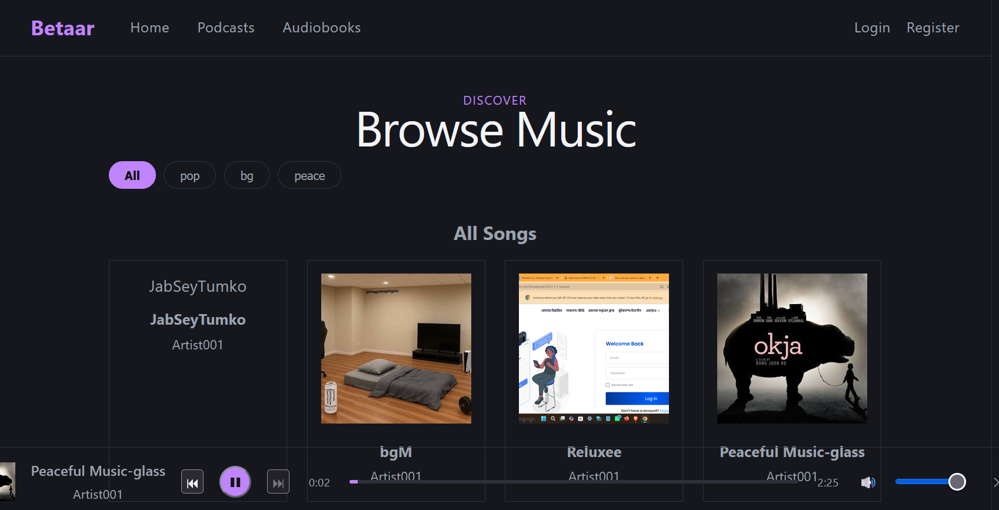 | 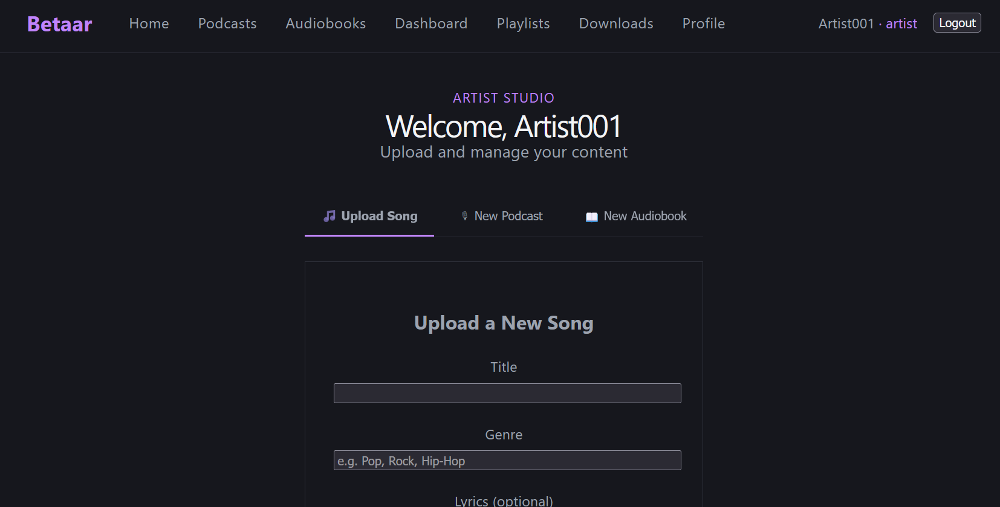 | 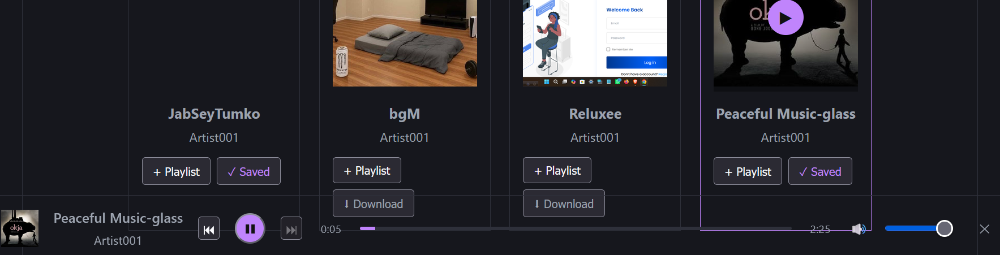 |

| Podcasts | Audiobooks | Playlists |
|----------|------------|-----------|
| 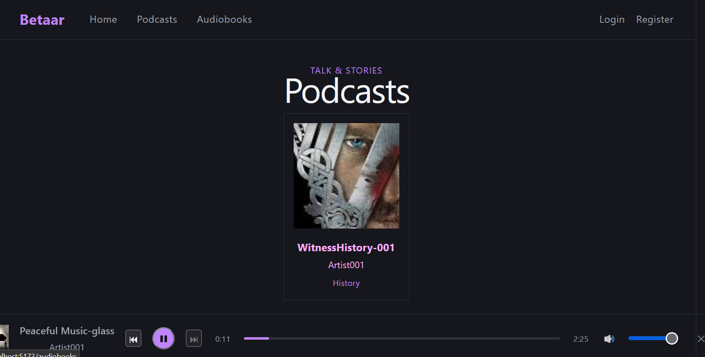 | 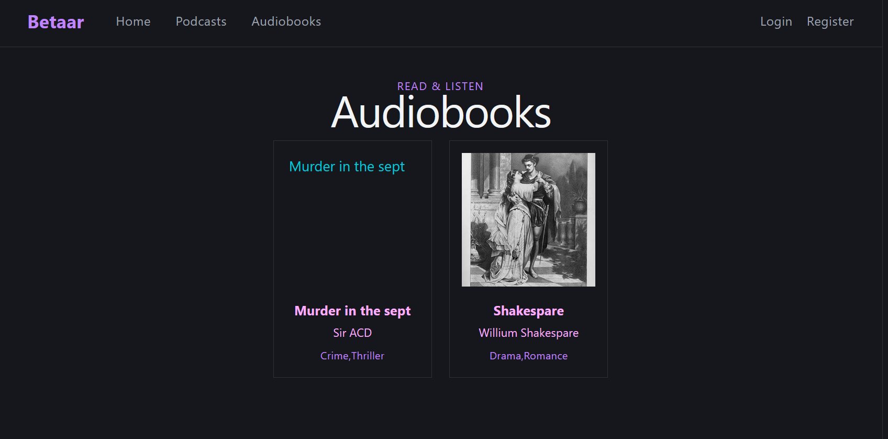 | 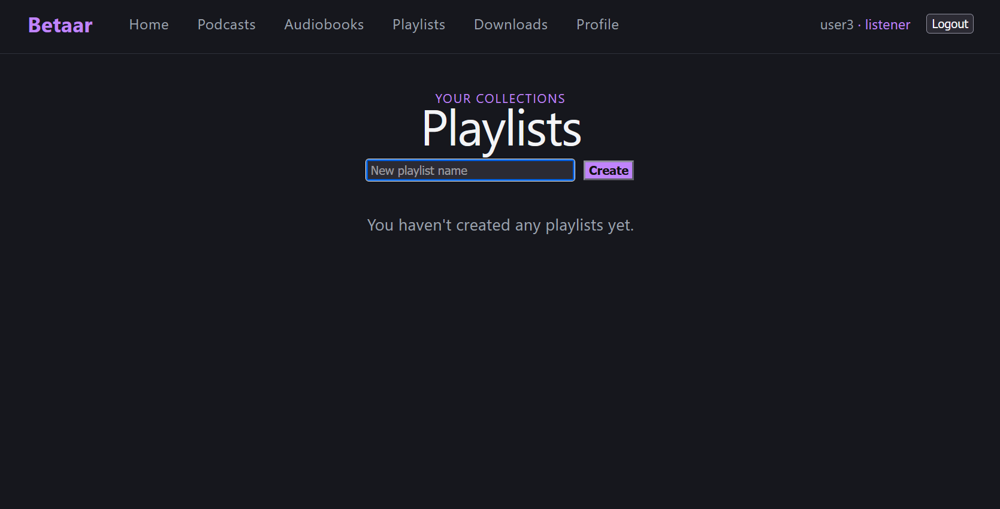 |

| Dashboard2 | Dashboard3 | Dashboard4 |
|----------|------------|-----------|
| 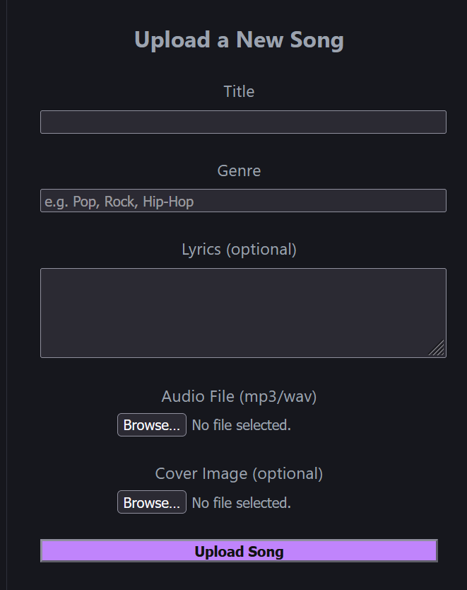 | 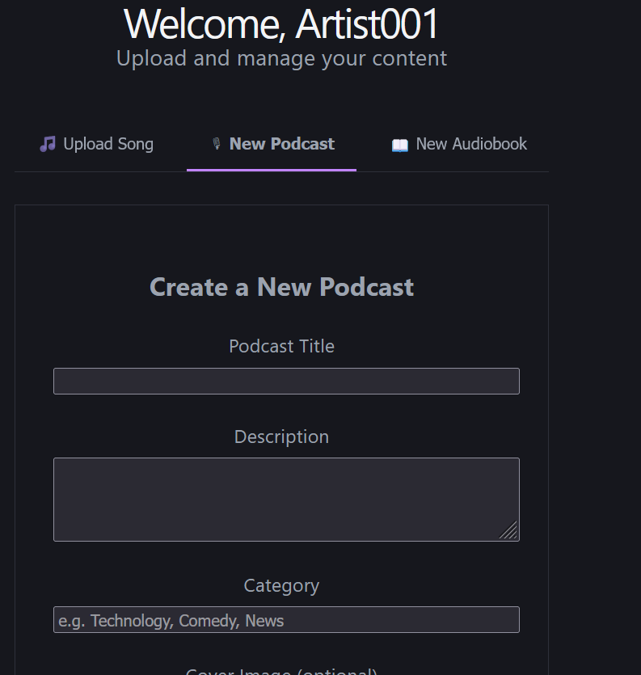 | 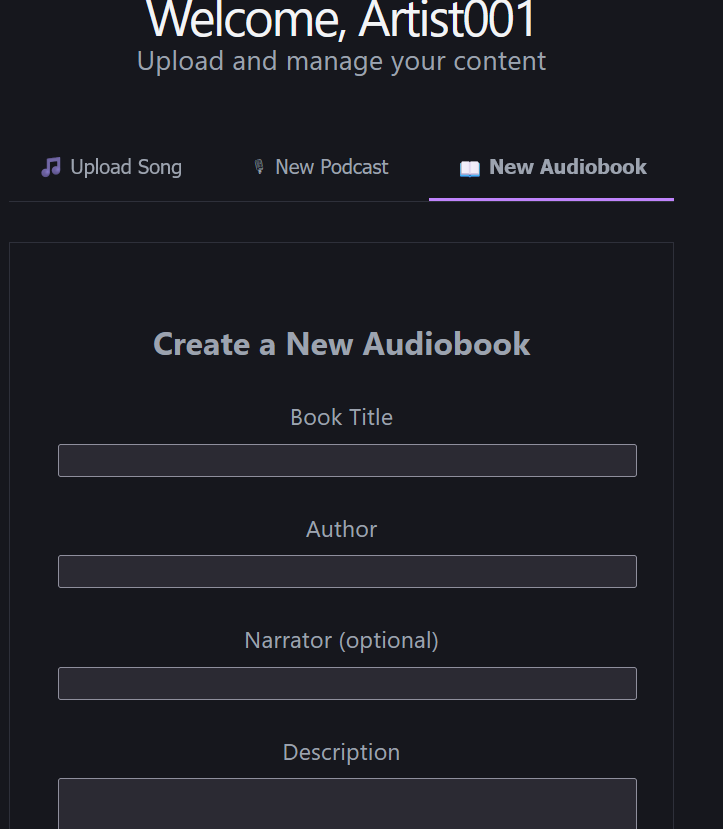 |

| Login | Register | Artist-reg |
|----------|------------|-----------|
| 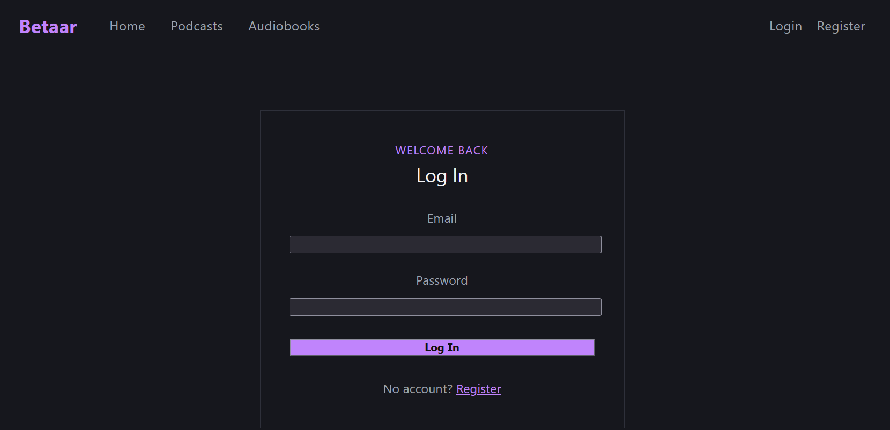 | 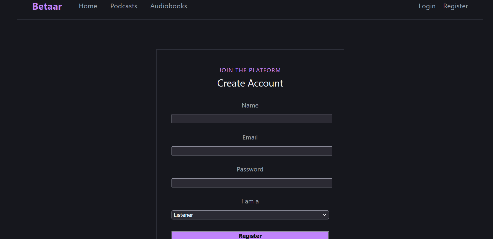 |  |

## 🛠 Tech Stack

**Frontend**
- React (Vite)
- React Router
- Axios
- Context API (Auth + Player state)
- Cache API (offline playback)

**Backend**
- Node.js + Express
- MongoDB + Mongoose
- JWT Authentication
- bcrypt (password hashing)
- Multer + Cloudinary (audio/image uploads)

## 📁 Project Structure

```
Betaar/
├── backend/
│   ├── config/          # DB & Cloudinary configuration
│   ├── controllers/      # Route logic (auth, songs, podcasts, audiobooks, playlists)
│   ├── middleware/       # Auth protection & file upload handling
│   ├── models/           # Mongoose schemas
│   ├── routes/           # API route definitions
│   └── server.js
│
└── frontend/
    ├── src/
    │   ├── components/   # Reusable UI (Navbar, PlayerBar, SongCard, etc.)
    │   ├── context/       # AuthContext, PlayerContext
    │   ├── pages/         # Route-level pages
    │   ├── services/      # API call layer (axios)
    │   └── styles/        # Shared design tokens
    └── index.html
```

## ⚙️ Setup

### Prerequisites
- Node.js
- MongoDB Atlas account (or local MongoDB)
- Cloudinary account (for audio/image storage)

### Backend

```bash
cd backend
npm install
```

Create a `.env` file in `backend/`:

```
MONGO_URI=your_mongodb_connection_string
PORT=5000
JWT_SECRET=your_jwt_secret
CLOUDINARY_CLOUD_NAME=your_cloud_name
CLOUDINARY_API_KEY=your_api_key
CLOUDINARY_API_SECRET=your_api_secret
```

```bash
npm run dev
```

### Frontend

```bash
cd frontend
npm install
npm run dev
```

The app will be available at `http://localhost:5173`.

## 🔑 Core Concepts

- **Single User model, role-based** — `User` documents have a `role` of `listener` or `artist`, driving which interface and routes are accessible, rather than maintaining separate user systems.
- **Cloud-first media** — all audio and images are uploaded directly to Cloudinary via Multer; MongoDB only stores metadata and URLs.
- **Unified player queue** — a global `PlayerContext` manages the currently playing track, queue, and playback state so audio persists across page navigation.
- **True offline support** — downloaded songs are cached via the browser's Cache API and served from cache when offline, not just downloaded as files.

## 📌 Status

Actively in development. Core features are complete and functional; UI/UX polish is ongoing.

## 📄 License

This project is for educational/personal portfolio purposes.